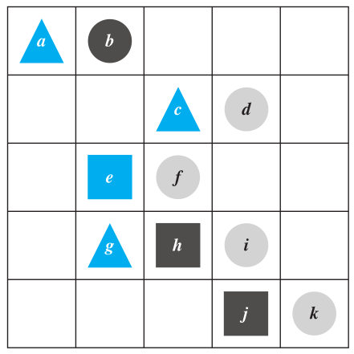

# Tarski's world

An educational tool for the semantics of
[first-order logic](https://en.wikipedia.org/wiki/First-order_logic)



<https://github.com/user-attachments/assets/66219d4a-a76c-444d-a945-ec81c240c94d>

## About

Attempting to recreate Barwise and Etchemendy's
[Tarski's world](https://www.gradegrinder.net/Products/tw-index.html)
in [Doodle's Reactor](https://github.com/creativescala/doodle)
using [Scala 3](https://www.scala-lang.org).
(I might switch to ScalaFX later.)

They use 3D objects (cube, tetrahedron, dodecahedron) but I'm going with 2D as in
[Epp's book](https://github.com/spamegg1/Epp-Discrete-Math-5th-solutions/).
The image above is taken from there.

## Acknowledgements

Thanks a lot to [Noel Welsh](https://github.com/noelwelsh) for his awesome Doodle library
and all the help on Discord.

Thanks to Jon Barwise (1942-2000) and John Etchemendy for their awesome idea and book
on Tarski's world.

## Dev Blog

See my adventures in bad design on my
[Github Pages](https://spamegg1.github.io/tarski's-world/)

## Info

This is a [Scala-cli](https://scala-cli.virtuslab.org/) project.
With Scala 3.5.0 and above, you can simply run `scala compile .` and `scala test .`.

## Module dependency

```scala
//     main
//       |
//     view   testing
//       |     /
//    controller
//       |
//     model
//       |
//    constants
```

You can read more about each module at:

- [Constants](constants/README.md)
- [Model](model/README.md)
- [Controller](controller/README.md)
- [View](view/README.md)
- [Test](test/README.md)
- [Main](main/README.md)

## Installation

Current version is 0.1.1 (Dec 02, 2025). Released for Scala 3 only.
(0.1.0 is broken, don't use it.)

You will need a JVM, and Scala 3. [This](https://www.scala-lang.org/download/)
should give you everything you need.

Also you'll need an IDE:

- [Metals](https://scalameta.org/metals/) extension on
  [Visual Studio Code](https://code.visualstudio.com/)
- [IntelliJ](https://www.jetbrains.com/idea/download/) with Scala plugin

For Scala-cli (or just plain `scala`), add to your `project.scala` (or any file):

```scala
//> using dep io.github.spamegg1::tarski:0.1.1
```

For SBT, add to your `build.sbt`:

```scala
libraryDependencies += "io.github.spamegg1" %% "tarski" % "0.1.1"
```

## API Docs

Can be found at [Javadoc](https://javadoc.io/doc/io.github.spamegg1/tarski_3/latest/index.html)

## Usage

To get a quick look and feel, you can execute `tarski.main.Example.runExample`.

Tarski's world is intended to be used interactively inside an IDE
such as IntelliJ or Visual Studio Code.

Generally, in an educational setting, a world and a list of formulas are given to you.
Then you run the program to evaluate the formulas, move or change the blocks,
add or change the formulas if necessary, based on what you are asked to do in exercises.
Of course, you can write your own worlds and formulas too.

### Running: an example

Then run it with `tarski.main.runWorld` to start interacting.
You will see the interactive window like the one above in the video.
Here are the details:

```scala
//> using dep io.github.spamegg1::tarski:0.1.1

import tarski.main.*, Shape.*, Sizes.*, Tone.*

val grid: Grid = Map(
  (1, 2) -> Block(Small, Tri, Green, "a"),
  (4, 3) -> Block(Mid, Tri, Blue),
  (5, 6) -> Block(Large, Cir, Gray, "d"),
  (6, 3) -> Block(Small, Squ, Blue)
)

val formulas = Seq(
  fof"¬(∃x Large(x))",
  fof"∀x Squ(x)",
  fof"∀x ¬ Cir(x)",
  fof"¬(∀x Small(x))",
  fof"∃x Tri(x)",
  fof"∀x Large(x)",
  fof"∃x Cir(x)",
  fof"a = b",
  fof"∀x ∃y Larger(x, y)",
  fof"c != d",
  fof"∀x (Squ(x) → Tri(x))",
  fof"∃x (Tri(x) ↔ Mid(x))",
  fof"¬(∃x (Cir(x) ∧ Small(x)))",
)

// The interface is 1600x800 by default.
// if the interface is too small or too large, try a different scale factor than 1.0:
@main
def run = runWorld(grid, formulas, 1.0)
```

You can add or remove blocks interactively.
Unfortunately editing the formulas inside the interface is not supported yet.
To edit the formulas, close the window, edit them in your IDE, then restart.

### Imports

All you need is to `import tarski.main.*`.
Optionally you can also `import Shape.*, Sizes.*, Tone.*`
to avoid repeatedly writing `Shape.`, `Sizes.` or `Tone.`.

### Blocks

Blocks have 3 attributes, each of which has 3 possible values:

|Attribute|value1|value2|value3|
|:-|:-|:-|:-|
|Tone|Blue|Green|Gray|
|Shape|Tri|Squ|Cir|
|Sizes|Small|Mid|Large|

Blocks can also have an optional name, only one of: `a, b, c, d, e, f`.
Other names are not allowed. Formulas can then refer to these names as constants.

### Grids

Then you can write a `Grid`, a map of positions `Pos` to `Block`s, to define the board.
It's an 8x8 standard chess board; coordinates are 0-indexed.
See above for details and an example.

### Formulas

Then you can write a list of first-order logic formulas, `FOLFormula`
(courtesy of [Gapt](https://github.com/gapt/gapt)).

The formulas use a special string interpolator `fof"..."`,
and can use the Unicode symbols or their ASCII equivalents for logical connectives:

|Connective|ASCII|Unicode|
|:-|:-|:-|
|and|`&`|`∧`|
|or|`\|`|`∨`|
|not|`-`|`¬`|
|implies|`->`|`→`|
|biconditional|`<->`|`↔`|
|forall|`!`|`∀`|
|exists|`?`|`∃`|

### Predicates for atomic formulas

The following predicates are supported:

#### Unary

|Syntax|Semantics|
|:-|:-|
|`Tri(x)`| "x is a triangle"|
|`Squ(x)`| "x is a square"|
|`Cir(x)`| "x is a circle"|
|`Blue(x)`| "x has color blue"|
|`Green(x)`| "x has color green"|
|`Gray(x)`| "x has color gray"|
|`Small(x)`| "x has size small"|
|`Mid(x)`| "x has size mid"|
|`Large(x)`| "x has size large"|

#### Binary

|Syntax|Semantics|
|:-|:-|
|`Left(x, y)`|"x is to the left of y"|
|`Right(x, y)`|"x is to the right of y"|
|`Below(x, y)`|"x is below y"|
|`Above(x, y)`|"x is above y"|
|`Adjoins(x, y)`|"x is adjacent (but not diagonally) to y"|
|`Smaller(x, y)`|"x is smaller than y"|
|`Larger(x, y)`|"x is larger than y"|
|`x = y`|"x is equal to y"|
|`SameRow(x, y)`|"x is on the same row as y"|
|`SameCol(x, y)`|"x is on the same column as y"|
|`SameSize(x, y)`|"x has the same size as y"|
|`SameShape(x, y)`|"x has the same shape as y"|
|`SameTone(x, y)`|"x has the same tone as y"|

#### Ternary

|Syntax|Semantics|
|:-|:-|
|`Betw(x, y, z)`|"x is between y and z (vertically, horizontally or diagonally)"|

## Exercises

You can work through the examples in the
[companion repository](https://github.com/spamegg1/tarski-examples)

## Work in progress

Stay tuned!
